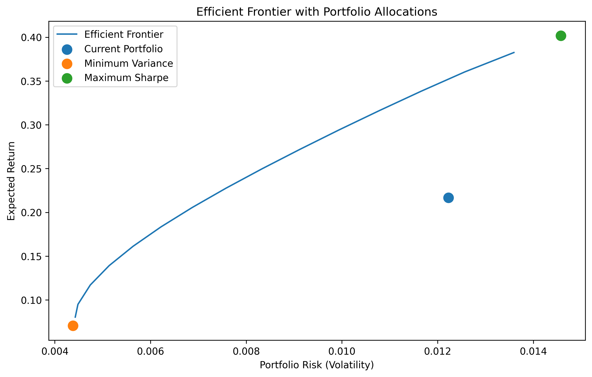

# Portfolio Optimization using the Markowitz Model

)

Portfolio optimization using the Markowitz mean–variance framework applied to a real personal portfolio.

---

## Efficient Frontier

The chart above shows the efficient frontier together with:

- Current portfolio allocation
- Minimum variance portfolio
- Maximum Sharpe ratio portfolio

---

## Features

This project implements a complete portfolio optimization workflow:

- Download historical market data from Yahoo Finance
- Compute daily asset returns
- Estimate the covariance matrix
- Construct the minimum variance portfolio
- Compute the maximum Sharpe ratio portfolio
- Generate the efficient frontier
- Compare optimized portfolios with the current allocation

---

## Methodology

The optimization framework follows the classical Markowitz portfolio theory.

The portfolio variance is defined as:

$$
\sigma_p^2 = w^T \Sigma w
$$

where:

- **w** = vector of portfolio weights  
- **Σ** = covariance matrix of asset returns  

The efficient frontier is generated by solving a sequence of constrained optimization problems.

---

## Results

The analysis compares three portfolios:

- Current portfolio
- Minimum variance portfolio
- Maximum Sharpe ratio portfolio

and evaluates them in terms of:

- expected return
- volatility
- Sharpe ratio.

---

## Technologies Used

- Python
- NumPy
- Pandas
- CVXPY
- Matplotlib
- Yahoo Finance API
